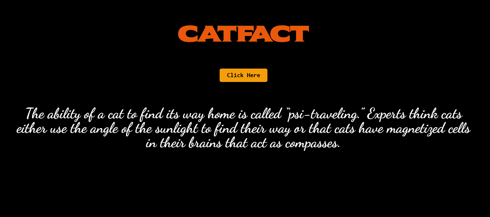
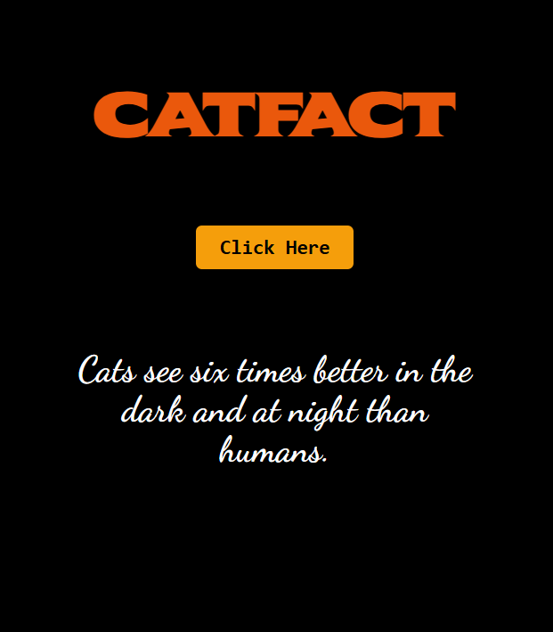

# 🐱 CatFact App

A simple and fun React application that fetches random cat facts from a public API and displays them on the screen. Built using **React**, **Axios**, and styled with **Tailwind CSS**.

---

## 🚀 Features

* Fetches random cat facts from an external API
* Uses React Hooks (`useState`)
* API handling with Axios
* Clean and responsive UI using Tailwind CSS
* One-click interaction to get a new cat fact

---

## Preview


## Mobile Screen


## 🛠️ Tech Stack

* **React** – Frontend library
* **Axios** – HTTP client for API requests
* **Tailwind CSS** – Utility-first CSS framework
* **CatFact API** – [https://catfact.ninja/fact](https://catfact.ninja/fact)

---

## 📦 Installation & Setup

Follow these steps to run the project locally:

### 1️⃣ Clone the repository

```bash
git clone https://github.com/your-username/catfact-app.git
cd catfact-app
```

### 2️⃣ Install dependencies

```bash
npm install
```

### 3️⃣ Start the development server

```bash
npm start
```

The app will run at:
👉 `http://localhost:3000`

---

## 📂 Project Structure

```
catfact-app/
├── src/
│   ├── App.js
│   ├── index.js
│   └── index.css
├── public/
├── package.json
└── tailwind.config.js
```

---

## 📸 Preview

* Dark-themed UI
* "Click Here" button fetches a new cat fact
* Fact text updates dynamically without page reload

---

## 🔑 How It Works

* Initial state shows a default message: **"Cats are curious"**
* Clicking the button triggers an API call using Axios
* Response data is stored in state and displayed instantly

---

## 🧠 Learning Outcomes

* Using async/await with Axios
* Managing state in React
* Making API calls on user interaction
* Styling React apps with Tailwind CSS

---

## 📌 Future Improvements

* Add loading and error states
* Add animations
* Save favorite facts
* Add category-based facts

---

## 🙌 Acknowledgements

* Cat Facts API: [https://catfact.ninja](https://catfact.ninja)
* Google Fonts & Tailwind CSS

---

## 📜 License

This project is open-source and free to use for learning purposes.

---

Happy Coding 😸

